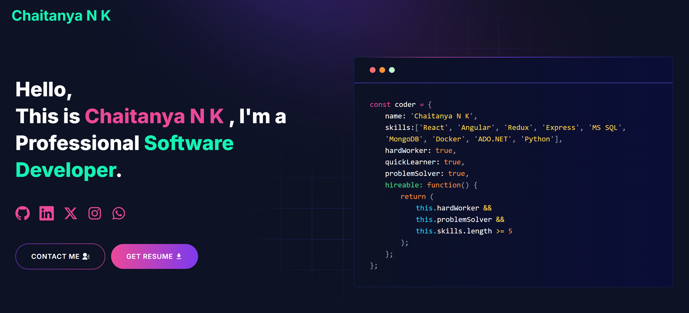

# Developer Portfolio

# Demo :movie_camera:

## View Live Preview: [here](https://chaitanya-nk.netlify.app/).

--

## Table of Contents :scroll:

- [Sections](#sections-bookmark)
- [Demo](#demo-movie_camera)
- [Deployment](#deployment-rocket)
- [Tutorials](#tutorials-wrench)
  - [Gmail App Password Setup](#gmail-app-password-setup)
  - [Create a Telegram Bot](#create-a-telegram-bot)
- [Packages Used](#packages-used-package)

# Sections :bookmark:

- HERO SECTION
- ABOUT ME
- EXPERIENCE
- SKILLS
- TOOLS
- PROJECTS
- EDUCATION
- ACHIEVEMENTS
- CONTACTS

# Deployment :rocket:

Deploying the app to platforms like Netlify is quick and easy.

## Deploying to Netlify:

1. **Sign up or log in** to [Netlify](https://www.netlify.com/).
2. In the **Netlify Dashboard**, click **"New site from Git"**.
3. Connect your **GitHub** account and select your repo.
4. Configure your environment variables by going to **Site Settings > Build & Deploy > Environment** and adding keys from your `.env` file.
5. Click **Deploy Site**. Netlify will build and deploy your portfolio.

# Tutorials :wrench:

## Gmail App Password Setup

1. **Log in to your Google Account** at [https://myaccount.google.com/](https://myaccount.google.com/).
2. Navigate to **Security** from the left sidebar.
3. Scroll down to the **"Signing in to Google"** section and make sure **2-Step Verification** is turned ON.
4. Once 2-Step Verification is enabled, you'll see an option for **App Passwords**.
5. Click on **App Passwords**. You may need to enter your Google account password again.
6. In the **Select app** dropdown, choose "Mail", and for **Select device**, choose "Other (Custom name)" and name it appropriately (e.g., "Portfolio").
7. Click **Generate**. A 16-character app password will be displayed. Save this password for later use in your environment variables (e.g., `GMAIL_PASSKEY`).

## Create a Telegram Bot

1. **Open Telegram** and search for the user **@BotFather**.
2. Start a chat with BotFather and use the `/newbot` command to create a new bot.
3. Choose a name for your bot.
4. Set a unique username for your bot (must end with `bot`, e.g., `PortfolioAssistantBot`).
5. Once your bot is created, BotFather will send you a **Token**. Save this token, as you will need it for your environment variables (e.g., `TELEGRAM_BOT_TOKEN`).
6. To get your chat ID:
   - Open your bot in Telegram and send it a message.
   - Visit the following URL in your browser, replacing `BOT_TOKEN` with your actual bot token:  
     `https://api.telegram.org/bot<BOT_TOKEN>/getUpdates`
   - Look for the `chat` object in the response, which contains your **chat ID** (you can use this value for `TELEGRAM_CHAT_ID`).

# Packages Used :package:

|   Used Package List    |
| :--------------------: |
|    @emailjs/browser    |
|  @next/third-parties   |
|         axios          |
|      lottie-react      |
|          next          |
|       nodemailer       |
|         react          |
|       react-dom        |
|   react-fast-marquee   |
| react-google-recaptcha |
|      react-icons       |
|     react-toastify     |
|         sharp          |
|          scss          |
|      tailwindcss       |